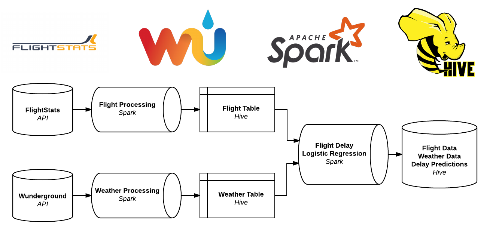

# W205 Final Project: Spark Flight Predictions

## Major File Descriptions

- `flightMaster.sh` Bash shell script to batch update the current flight information, current weather information, and make predictions by calling the following helper scripts.
  - `flightTracksUpdate.py` Data ingestion script that queries the FlightStats API and updates directory with current flight json files.
  - `flightTracksHiveUpload.py` Data processing script that loads current flight json files into Apache Spark and transforms them before saving to Hive.
  - `get_weather_new.py` Data ingestion and processing script that queries the Wunderground API and transforms resulting jsons before saving to Hive.
  - `MLPredict.py` Data processing and serving script that joins data from the flight and weather Hive tables and passes them to a pickled logistic regression ML model to make  predictions and save back to Hive.
  
  
  
- `delay_checker.py` Data serving script that allows a user to query the resulting predictions table.
  - If two airports are entered, query returns flights being tracked on that route and the current flight, weather, and prediction information.
  - If no arguments are entered, query returns top 100 flights most likely to be delayed.

- `flightStreaming.py` Demonstration of basic streaming capability that will aggregate total number of flights and current average delay and print to the console. 
  - Requires data from the directory `/FlightStats_sample_date/tracking` to be copied into a `/tmp/streaming` directory.
  - After running `flightStreaming.py`, a helper bash script `/FlightStats_sample_date/tracking/timer.sh` is available to demonstrate a pseudo-streaming application.

## Further Information

Please see the document `Architecture.pdf` for more in-depth information about the construction of all components of this project.